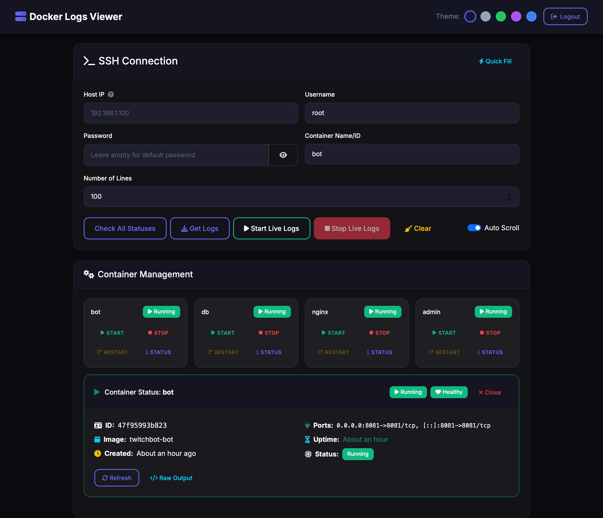

# AIMLUL Twitch Bot

[](https://python.org)
[](https://github.com/TwitchIO/TwitchIO)
[](https://postgresql.org)
[](https://docker.com)
[](https://github.com/psf/black)
[](LICENSE-MIT)

**Высоконагруженный Twitch бот с интеграцией PostgreSQL**, разработанный специально для канала [AIMLUL](https://twitch.tv/aimlul).

Этот бот создан для автоматизации и усиления интерактивности канала, обеспечивая бесперебойную работу всех ключевых процессов.
Он управляет продвинутыми игровыми механиками, ведёт детализированную статистику игроков и обрабатывает EventSub-награды, поддерживая стабильность и динамику чата.
Дополнительно встроенная админ-панель позволяет отслеживать состояние Docker-контейнеров, управлять ими и анализировать логи в реальном времени, обеспечивая полный контроль над инфраструктурой стрима.

## 🚀 Основные функции

### 🎮 Игровые команды
| Команда | Описание                                                   | Доступ                         |
|---------|------------------------------------------------------------|--------------------------------|
| `!я`    | Показать персональную статистику, ранг                     | Все пользователи               |
| `!топ`  | Топ-3 игрока по победам в игре "21 очко"                   | Все пользователи               |
| `!дрын` | Таймаут (15 секунд) случайного активного пользователя      | Модераторы + привилегированные |
| `!жопа` | Случайный эффект (таймаут 0/60/600 секунд активировавшему) | Все пользователи               |


### 🎁 Игры за баллы канала
| Награда              | Описание                                                                                            |
|----------------------|-----------------------------------------------------------------------------------------------------|
| Очко                 | Переработанная карточная игра. Цель — набрать близко к 21 и обыграть оппонента                      |
| Испытание пивом      | Укажи число от 1 до 20 литров. Чем больше - тем сложнее выйграть. При неудаче — таймаут на 1 минуту |
| Вскрыть пивную кегу  | До 50 случайных зрителей получают таймаут на 10 минут с анимацией и обратным отсчетом               |
| Кабанчики            | Во время кеги попытаться отменить ее эффект совместными усилиями чата                               |
| Спрятаться в помойке | Во время кеги позволяет гарантированно избежать таймаута                                            |


### 🔥 Автоматические триггеры
| Триггер         | Описание                                | Реакция                    |
|-----------------|-----------------------------------------|----------------------------|
| `gnome`         | Обнаружение спама смайлом Gnome         | Таймаут случайного спамера |
| `applecatpanik` | Обнаружение спама смайлом AppleCatPanik | Таймаут случайного спамера |

### ⚙️ Системные команды
| Команда | Описание | Доступ |
|---------|----------|--------|
| `!ботзаткнись` | Полное отключение обработки команд | Администраторы |
| `!ботговори` | Включение обработки команд после отключения | Администраторы |

### 🏆 Система рангов
- Автоматическое присвоение рангов на основе количества побед
- Динамическое обновление статистики в реальном времени
- Постоянное хранение данных в PostgreSQL

## 🖥️ Админ-панель управления

### 🔧 Функциональность админки
| Функция | Описание | Доступ |
|---------|----------|--------|
| **Просмотр логов** | Получение логов контейнеров в реальном времени | Все авторизованные пользователи |
| **Управление контейнерами** | Запуск, остановка, перезагрузка контейнеров | Все авторизованные пользователи |
| **WebSocket логи** | Потоковая передача логов в реальном времени | Все авторизованные пользователи |
| **Мониторинг** | Статус контейнеров и базовая статистика | Все авторизованные пользователи |


## 🏗️ Технологии

- **Python 3.13.5+** - основной язык с асинхронной архитектурой
- **FastAPI** - высокопроизводительный ASGI фреймворк для API и админ-панели
- **TwitchIO 2.1.0** - нативная библиотека для работы с Twitch API и IRC
- **Docker & Docker Compose** - контейнеризация и оркестрация
- **PostgreSQL 17** - основная реляционная база данных
- **SQLAlchemy 2.0+** - асинхронный ORM
- **asyncpg** - высокопроизводительный асинхронный драйвер PostgreSQL
- **Alembic** - система миграций базы данных
- **aiohttp** - асинхронные HTTP-клиенты для внешних запросов
- **Pydantic** - валидация данных и настройки
- **JWT (PyJWT)** - аутентификация и авторизация
- **bcrypt** - безопасное хэширование паролей
- **asyncssh** - асинхронное управление контейнерами через SSH
- **WebSocket** - потоковая передача логов Docker

### 🛠️ Инструменты разработки
- [pre-commit](https://pre-commit.com/) — автоматизация форматирования кода и запуск линтеров перед коммитом
- [Ruff](https://github.com/charliermarsh/ruff) — быстрый статический анализ кода и проверка на потенциальные ошибки
- [Black](https://github.com/psf/black) — единообразное автоформатирование кода
- [isort](https://pycqa.github.io/isort/) — упорядочивание и оптимизация импортов

### 🏛️ Архитектурные особенности
- **Модульная структура** - разделение на игры, команды и утилиты
- **Асинхронная обработка** - параллельное выполнение операций
- **Кэширование запросов** - оптимизация производительности
- **EventSub интеграция** - обработка наград через WebSocket
- **Автообновление токенов** - бесперебойная работа 24/7
- **Обработка ошибок** - устойчивость к сбоям
- **Система кулдаунов** - защита от спама команд

## ⚙️ Настройка и установка

### Предварительные требования
- Docker 24.0+
- Docker Compose 2.20+
- Python 3.13+ (для локальной разработки)

### Для запуска:
1. Создать приложение и получить client_id и client_secret: [Twitch Developer Console](https://dev.twitch.tv/console/apps)
2. **Заполнить настройки:**
   - Скопировать `.env.example` → `.env`
   - **Обязательно указать:** SSH хост, пользователь и пароль для доступа к Docker (для админки)
   - Заполнить `settings.ini` для бота
3. Запустить utils/token_generator.py для генерации access_token и refresh_token (опционально)
4. Запуск:
```docker compose up --build -d```
5. **Админ-панель:** Будет доступна по IP-адресу сервера через HTTPS
   - Пример: `https://192.168.1.100` (замените на ваш IP)
   - Логин/пароль из переменных `AUTH_USERNAME`/`AUTH_PASSWORD` в `.env`

### Для применения миграций БД
```docker compose exec bot alembic upgrade head```

### 🔑 Требования для работы с баллами канала

Для работы с наградами и начислением баллов канала через EventSub потребуется **токен стримера** с необходимыми правами (`scope`):

- `channel:read:redemptions` — чтение информации о выкупленных наградах
- `channel:manage:redemptions` — возможность помечать награды как выполненные

### Проверка кода, форматирование, тестирование (для разработчиков)

Запуск линтеров, форматеров и проверок типов

```pre-commit run --all-files```

Выборочно:

```mypy src```

```ruff check --fix```

```black src```

```isort src```


### Запуск тестов

Локально: ```pytest```

Внутри контейнера: ```docker compose exec bot pytest```
